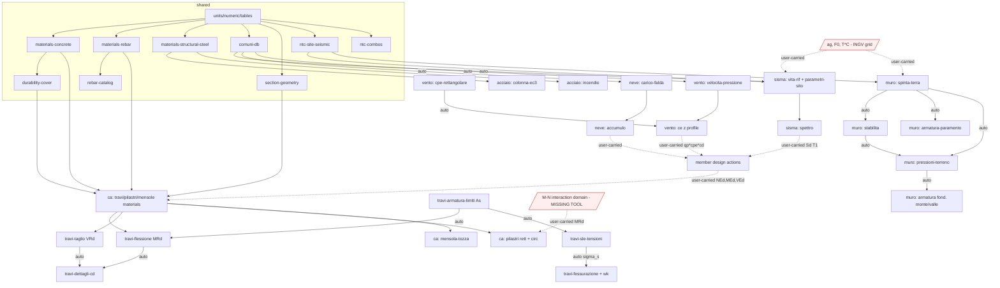

# StruttureMenni — Architecture

Target: 12 Excel workbooks → ~30 pure, tested calculation tools. Language-neutral. Conventions below are
binding regardless of stack.

**Core rules.** (1) Each tool is a pure function `f(inputs) -> outputs + diagnostics`; no hidden sheet state —
Excel cross-sheet reads (`Tabelle!C3:C6 -> Neve!H9`) become explicit parameters. (2) Units in every name
(`b_mm`, `Ned_kN`, `fcd_MPa`); conversions only in `units`. (3) Inputs validated at the boundary (enum domain,
range, required-together), failing with the NTC clause. (4) Outputs immutable; checks return
`{value, limit, ratio, passed}`, not a bare boolean. (5) Spec cell IDs kept as `sourceCell` metadata for
fixture traceability — never as field names.

## 1. Module map

### 1.1 Shared (built first, no dependencies on tools)

| Module | Responsibility | Public API (in → out) | Implements |
|---|---|---|---|
| `units` | Unit tags + conversions | `kN_to_N`, `m_to_mm`, `MPa == N/mm²` alias; assert-compatible | — |
| `numeric` | Interpolation/clamp/roots | `lerp(x,x0,y0,x1,y1)`, `clamp(v,lo,hi)`, `bisect(f,a,b)`, `fixpoint(f,x0,tol)` (replaces Excel iterative circular refs, e.g. pilastri cotθ) | — |
| `tables` | Lookup engine | `exactLookup(table,key)`, `bandLookup(table,x)` (VLOOKUP-TRUE), `interpLookup`, `hlookup`; all raise typed `KeyNotFound` instead of `#N/A` | — |
| `comuni-db` | Merged municipality DB, 8101 rows | `lookupComune(name) -> {regione, provincia, istat, zonaSismica 1-4, zonaVento 1-9, zonaNeve I-alp/I-med/II/III}`; `searchComune(prefix)` | §1 merge rules below |
| `materials-concrete` | Concrete class table | `concrete(cls: "C8/10".."C50/60") -> {Rck, fck, fcm, Ecm, fctm, fcd(γc), fctd}` MPa | NTC18 §4.1.2.1.1, §11.2.10 |
| `materials-rebar` | Rebar grade table (union roster) | `rebarSteel(grade: B450C\|B500C\|FeB22k\|FeB32k\|FeB38k\|FeB44k\|RB500W) -> {fyk, ftk, σ_amm, fyd(γs), Es=210000}` MPa | NTC08/18 §11.3.2 |
| `materials-structural-steel` | EN grades + partial factors | `steel(grade: S235..S460, t_mm) -> {fyk, fuk, E, G}`; `partialFactors() -> {γM0, γM1, γM2}` | EN1993-1-1 §3.2, §6.1 |
| `fire-reduction` | ISO834 curve + reduction factors | `iso834(t_min) -> θ_C`; `reduction(θ_C) -> {ky, kp, kE}` (interpolated, Table 3.1) | EN1993-1-2 §3.2, Tab.3.1 |
| `rebar-catalog` | Bar geometry + crack σs table | `barArea(ø_mm)`, `nBars(As_req, ø)`, `barCallout(n,ø)`, `sigmaSLimit(ø_mm, w_lim)` (interpolating, **not** exact-match) | NTC08 §4.1.2.2.4 Tab. |
| `durability-cover` | Exposure→cover (extracted from the two `Tabelle` sheets) | `cnom(exposureClass, structuralClass, memberShape, prestressed) -> {cmin_dur, Δc_dev, cnom}` mm | NTC18 §4.1.6.1.3, EC2 §4.4.1 |
| `section-geometry` | Gross/cracked section props | `rect(b,h)`, `circle(D)` → `{A, I, i_gyr, W}`; `crackedNA(b,h,d,As,As2,n=15) -> {x, Ii}`; `equivalentSquare(A)` | NTC08 §4.1.2.2.5.3 |
| `ntc-site-seismic` | **Single** implementation of the NTC hazard/site chain (today duplicated in `sisma` + `muro-sostegno`) | `Cu(classeUso)`, `VR(VN,Cu)`, `TR(VR, SL) -> yr`, `amplification({catSottosuolo A-E, catTopografica T1-T4, ag_g, F0, Tc_star_s}) -> {Ss, Cc, St, S}`, `cornerPeriods(...) -> {TB,TC,TD}` s | NTC18 §2.4.3, §3.2.1, §3.2.2, Tab.3.2.IV/V/VI |
| `ntc-combos` | Partial-factor & combination tables | `factors(combo: STR_1\|STR_2\|GEO_1\|GEO_2\|EQU_1\|EQU_2) -> {γG_fav, γG_unfav, γQ, γφ}`; `psi(category, kind)` | NTC18 Tab.2.6.I, 6.2.I |
| `report` | Shared result envelope | `{ok, data, checks[], warnings[], errors[], inputsEcho}` | — |

### 1.2 Loads (actions)

| Module | Public API | Spec |
|---|---|---|
| `load-sisma/vita-riferimento` | `(VN_yr, classeUso) -> {Cu, VR_yr, TR: {SLO,SLD,SLV,SLC}}` | NTC18 §2.4.3 eq.3.2.1 |
| `load-sisma/parametri-sito` | `(ag_g, F0, Tc_star_s, catSottosuolo, catTopo) -> {Cc, Ss, St, S}` | §3.2.2, §3.2.3.2.1 |
| `load-sisma/fattori-struttura` | `(ξ_pct, q0, KR, statoLimite) -> {η, q, qv, ηv}` | §3.2.3.5, §7.3.1 |
| `load-sisma/spettro` | `(S, η, q, ag_g, F0, TB,TC,TD, statoLimite, samples) -> [{T_s, Se_g, Sd_g}]` (96 pts @0.05 s) | §3.2.3.2.1 eq.3.2.4-3.2.7 |
| `load-neve/carico-falda` | `(comune\|zona, as_m, topografia, Ct, roofType: 1\|2-pitch, α1_deg, α2_deg) -> {qsk, CE, Ct, μ1[], qs_kNm2[]}` | NTC18 §3.4 |
| `load-neve/accumulo` | `(zona, as_m, topografia, Ct, α_deg, b1,b2,h_m, γ_snow) -> {μw, μs, μ_tot, ls_m, qs_drift}` | Circ. §C3.4.5.6 |
| `load-vento/velocita-pressione` | `(comune\|zona, as_m, VR_yr\|TR, ...) -> {vb, vr, qb_Nm2}` | NTC18 §3.3.1-3.3.2 |
| `load-vento/esposizione` | `(classeRugosita, catEsposizione, z_m, zmin, z0, kr, ct) -> {ce(z)}`; `profile(H, n) -> [{z, ce, qp}]` (n parametric, no row-1005 sentinel) | Circ. §C3.3.2 |
| `load-vento/cpe-rettangolare` | `(b,d,h_m) -> {windward, side, leeward, roof} × 2 directions` | Circ. §C3.3.8.1 |

### 1.3 Members (resistances)

| Module | Public API | Spec |
|---|---|---|
| `ca/travi-flessione-slu` | `(b,h,c,As,As2, fcd, fyd) -> {d, y, MRd_kNm}` | NTC08 §4.1.2.1.2 |
| `ca/travi-taglio-slu` | `(b,h,d, Asw,s,α, fcd,fyd, NEd) -> {cotθ, VRcd, VRsd, VRd_kN}` | §4.1.2.1.3.2 |
| `ca/travi-armatura-limiti` | `(b,h,d, fctm, fyk, Ac) -> {As_min, As_max, As_eff, checks}` | §4.1.6.1.1 / EC2 §9.2.1.1 |
| `ca/travi-sle-tensioni` | `(Mrara, Mqp, section, As, n=15) -> {x, σc, σs per combo, limits}` | §4.1.2.2.5.3 |
| `ca/travi-fessurazione` | `(σs, ø, cover, combo, w_lim) -> {σs_lim, passed}` | §4.1.2.2.4 |
| `ca/travi-dettagli-cd` | `(CD: CDA\|CDB, geom, stirrups, MRb_top/bot, L_n) -> {Lcr, s_max, VEd_cd, checks}` | §7.4.6.2.2, §7.4.4 |
| `ca/taglio-non-armato` | `(b,d, fck, ρl, σcp) -> {VRd1, VRd2, VRd_kN}` | NTC18 §4.1.2.3.5.1 |
| `ca/pilastro-rettangolare` | `(b,h,c, L, NEd, MRd_in, rebar, stirrups, fcd,fyd, CD) -> {σcp, NRd, VRd, VEd_cd, ρ_min/max, s_conf, λ, λ_lim, checks}` | §4.1.2.1.3.2, §4.1.6.1.2, §7.4.6.2.1/2 |
| `ca/pilastro-circolare` | same signature with `D` in place of `b,h`; shear via `equivalentSquare` | idem |
| `ca/mensola-tozza` | `(a,h,b, geom, rebar, fcd,fyd, PEd) -> {PRS, PRC, PRd, checks}` (strut-and-tie) | NTC18 §4.1.6.1.3 |
| `ca/fessurazione-tensioni` | `(sections[], M_rara, M_qp, geom) -> per-section {σc, σs, limits}`; sibling `-semplificata` `(ø, combo) -> {passed}` | NTC18 §4.1.2.2.5 / §4.1.2.2.4 |
| `ca/fessurazione-wk` | `(σs, Es, fctm, Ec, ρeff, c, ø, k1..k4, loadDuration, w_lim) -> {srm, εsm, wk, passed}` | Circ. §C4.1.2.2.4.5 |
| `muro/spinta-terra` | `(geom, soil, q, seismic, combo) -> {Ka, Kae, kh, kv, θ, Wmuro, Wterr, S_h, S_v, M}` for 6 static + 2 seismic combos | NTC18 §6.5.3.1.1; EC8-5 §7.11.6.2.1 (Mononobe-Okabe) |
| `muro/stabilita` | `(thrust, weights, B, tanδ) -> {OR, OS}` per combo | §6.5.3.1.2; EC7 §6.5.3-6.5.4 |
| `muro/pressioni-terreno` | `(N, M, B) -> {e, e<B/6, p_monte, p_valle}` | EC7 Annex D |
| `muro/armatura-paramento` | `(thrust, h, fcd, fyd, cover) -> {As_nec, callout}` | §4.1.2 |
| `muro/armatura-fondazione` | `(side: monte\|valle, pressures, weights, geom, mat) -> {As_nec, callout}` — one module, two modes | §4.1.2 |
| `acciaio/colonna-ec3` | `(profile, grade, L, ky/kz, NEd, MyEd, MzEd, VEd) -> {classSection, NcRd, McRd, Nb,y/z,Rd, Mb,Rd, χLT, curve, shearBuckling, interaction 6.61/6.62}` | EN1993-1-1 §6.2, §6.3, Annex B |
| `acciaio/incendio` | `(grade, t_exposure_min[]) -> [{θ, ky, kp, kE, fy_θ, fu_θ, E_θ}]` | EN1993-1-2 §3.2, Tab.3.1 |

## 2. Dependency graph

Solid = automatic (computed and passed in-process). Dashed = **user-carried**: the value leaves the tool suite
(structural analysis model, INGV hazard query, missing M-N domain tool) and comes back as a validated input.
Every user-carried edge needs a provenance field (`{value, source, note}`) so reports state where it came from.

## 3. Merge conflicts and resolution rules

| # | Conflict | Facts | Rule |
|---|---|---|---|
| C1 | `ca-travi/Tabelle` vs `ca-mensole/Tabelle` — Δ13 | Only ~6 semantic groups. Rebar roster differs: travi has `FeB22k(215/335/115)` + `RB500W(500/650/280)`; mensole has `B500C(500/600/400)` and no RB500W. Concrete table M34:R41 **byte-identical**. | Rebar table = **union** keyed by grade name; verify each grade against NTC §11.3.2 before admitting; per-tool `allowedGrades` allowlist reproduces each sheet's dropdown. Concrete table = single source. |
| C2 | Same Δ13 — durability block | `classe strutturale` S3 vs S4; `cmin,dur` 10/20 vs 15/25 mm; `cnom,dur` 20/30 vs 25/35; `ΔSshape` -1 vs 0; "elemento simile a soletta" si/no; row-7 label "SETTI E SOLETTE" vs "PILASTRI". | These are **not table data, they are per-member inputs**. Do not merge — extract into `durability-cover` computing `cnom` from (exposure class, structural class, shape, prestress) per NTC §4.1.6.1.3. Sheet values become golden fixtures for member type = beam / corbel. |
| C3 | `Comuni`: sisma ≡ vento (Δ0, 8101 rows); neve copy diverges | `Provincia` 105 rows (neve has *Monza e Brianza*, sisma still *Milano* — neve is newer); `Vento` 377 rows where neve holds the **invalid literal `56`** (= zones 5:168 + 6:209 collapsed → corrupt); `Neve` 495 rows, sisma has 26 blanks, neve has none. | **Per-column provenance merge** into one `comuni-db`: Regione/Istat/Comune/Sismica/Vento ← sisma-vento copy; Provincia + Neve zone ← neve copy. Validate on load: zonaVento ∈ 1..9, zonaSismica ∈ 1..4, zonaNeve ∈ enum, no blanks, unique Istat. Fail the build on violation. |
| C4 | `ca-pilastri/Tabelle` vs travi/mensole | Pilastri uses M45:P49 (adds σ_amm col) and M34:O41 with `fck = 0.83·Rck`; travi carries precomputed fcm/Ecm/fctm. | Single table with the **superset of columns**; fck stored as a literal from NTC, with a build-time assertion `|fck − 0.83·Rck| ≤ 0.5`. |
| C5 | `ca-fessurazione/materiale-cls` rows 9 & 11 | C30/37 and C35/45 break the `fck=0.83·Rck` fill-down (C11=35 hardcoded). | Same table as C4; C35/45 fck=35 is the **correct** NTC value — the fill-down was the bug. Assertion in C4 catches the rest. |
| C6 | NTC 3.2.V (Ss) / 3.2.VI (St) implemented twice: `sisma/Tabelle!A7:F11` and inside `muro-sostegno` | muro `Tratto A` freezes Ss as a manual input; `Tratto B` computes it live. | One `ntc-site-seismic` module, always live. Frozen Tratto-A value becomes a golden fixture only. |
| C7 | neve: `Tabelle!C3:C6` qsk2 hardcodes `Neve!$H$9`; exposure table `A16:I20` duplicated (Δ0) on both sheets | Breaks `neve-accumulo` independence. | `qsk(zona, as_m)` takes altitude as a **parameter**, each tool passes its own; single `neve/exposure` table. |
| C9 | `muro-sostegno` Tratti B(Δ0)/C(Δ2)/D(Δ4)/E(Δ4) | Same logic, different inputs. | Not separate tools — 4 extra golden fixtures for the same `muro/*` modules. |

## 4. Build order (waves)

- **Wave 0 — foundations (parallel).** `units` S · `numeric` S · `tables` S · `report` S · `comuni-db` merge+validator **M** · `materials-concrete` S · `materials-rebar` S · `materials-structural-steel` S · `rebar-catalog` M · `section-geometry` M · `durability-cover` M · `ntc-combos` S. Plus **task 0a: validate the LibreOffice hard-recalc oracle** (§5) — blocking for Wave 2+ randomized testing.
- **Wave 1 — shared physics + simple leaves (parallel).** `ntc-site-seismic` **M** · `fire-reduction` S · `acciaio/incendio` S · `vento/cpe-rettangolare` S · `ca/taglio-non-armato` M · `ca/fessurazione-tensioni` S · `ca/fessurazione-semplificata` S.
- **Wave 2 — loads (parallel, after Wave 1).** sisma `vita-riferimento` S, `parametri-sito` M, `fattori-struttura` S, `parametri-spettro` S, `spettro` **L** · neve `carico-falda` M then `accumulo` M · vento `velocita-pressione` **L** + `esposizione` M.
- **Wave 3 — CA members (parallel, after Wave 0; independent of Wave 2).** `travi-armatura-limiti` S → `travi-flessione` M / `travi-taglio` M → `travi-sle-tensioni` M → `travi-fessurazione` M → `travi-dettagli-cd` M (chain, sequential inside). In parallel: `ca/mensola-tozza` M · `ca/fessurazione-wk` **L** · `ca/pilastro-rettangolare` **L** → `ca/pilastro-circolare` M (reuses ~80%).
- **Wave 4 — muro (mostly sequential).** `spinta-terra` **L** → `stabilita` M → `pressioni-terreno` M → {`armatura-paramento` S, `armatura-fondazione` M} parallel.
- **Wave 5 — acciaio + integration.** `acciaio/colonna-ec3` **L** (independent, can start at Wave 1 if capacity allows) · cross-tool wiring, provenance plumbing, report rendering **M**.

Critical path: Wave 0 → 1 → 2(spettro L) and Wave 4 (muro chain). Total ≈ 8 L, 16 M, 12 S.

## 5. Test strategy

1. **Golden fixtures (primary).** Every sheet's cached values are one frozen case per tool: `{inputs, expected, tolerance}` in a data file, extracted from `build/data/**`. Extras: `muro-sostegno` Tratti **B/C/D/E** (4 free cases for the same modules), `ca-fessurazione` 3 sections, `acciaio/incendio` 24 temperature rows, `sisma` 96 spectrum points. Tolerance: relative 1e-9 for pure arithmetic, 1e-6 where Excel's iterative solver was used (pilastri cotθ) — assert on the tolerance, never on float equality.
2. **Differential oracle (LibreOffice headless).** `soffice --headless --convert-to csv:"…"` with recalculation, driven over randomized inputs inside validated domains; compare tool vs sheet. **STATUS (2026-09-20): DONE — `extract/oracle.py` `recalculate(xlsx, overrides)` strips cached values via openpyxl so LibreOffice must compute every formula; validated on all 12 workbooks: 59,514 formula cells match Excel, only 3 differ (decimal comma vs point inside TEXT() strings: Vento!G40, Vento!G45, 'Apertura delle fessure'!D48). Still to check: one perturbed-input run per workbook.** Original task text: prove that a forced hard recalc actually happens — LibreOffice by default may emit *cached* values for `.xls`. Verification recipe: perturb one input cell, convert, check the dependent cell changed; if not, force via `Calc/Formula/Recalculation on File Load = Always recalculate` in the user profile registrymodifications, or drive a Basic macro (`ThisComponent.calculateAll()`) through `soffice --headless "macro:///…"`. If neither is reproducible, fall back to a formula-graph evaluator over `build/cellmaps/**` and record that as the oracle.
3. **Where the oracle must be disabled.** Any cell on the §6 fix list: the sheet is wrong there by construction. Those get a hand-computed expectation plus a `divergence.md` note.
4. **Property checks.** Monotonicity (MRd ↑ with As until over-reinforced; VRd ↑ with Asw; qs ↑ with altitude). Continuity: no jump > 1% across branch boundaries — this catches the neve α=30° and sisma Ss-clamp bugs. Dimensional invariance: scaling a section by k scales MRd by k³. Bounds: 1 ≤ cotθ ≤ 2.5; 1 ≤ Ss ≤ 1.8; Ka, Kae > 0; e ≤ B/2. Round-trip: all 8101 `comuni-db` rows return a valid zone triple.
5. **Coverage.** 80% minimum; 100% branch coverage on every `IF` transcribed from a sheet formula. Runner is table-driven — adding a workbook case is a data-file edit, not code.

## 6. Spreadsheet bugs — reproduce vs fix

Default policy: **fix, and record the divergence**; `reproduce` only where the "bug" may be an intentional
in-house convention. Every entry gets a test asserting the *chosen* behaviour.

| Where | Issue | Decision |
|---|---|---|
| sisma `Tabelle!E8` | Ss cat.B lower clip 0.4, should be 1.00 (Tab.3.2.V) | **FIX** — non-conservative, C/D/E already correct |
| sisma `N25` | case-sensitive compare on `slv`/`slc` vs uppercase dropdown | **FIX** — normalize case explicitly |
| Dead cells across units | sisma `I44/I45`+`Foglio2`+`Tabelle!D14:D16`; ca-travi `AM44`; ca-pilastri circ `H21`; ca-mensole `Z7`,`H12`; muro `F19`; ca-fessurazione `W7` (`#DIV/0!` k2 branch) | **DROP** — do not port (sisma qv/ηv revisit per D4) |
| neve `Tabelle!C3:C6` | qsk2 hardcodes `Neve!$H$9` | **FIX** — parameterize (C7) |
| neve-accumulo `H8` | VLOOKUP keyed on Provincia into Comune column | **FIX** — key on comune |
| neve-accumulo `H10` | `IF(as<200, qsk2, qsk1)` branches inverted vs NTC | **FIX** |
| neve `H32/H54/H58` | `AND(α>30, α<60)` strict → μ=0 exactly at α=30° | **FIX** — `30 ≤ α < 60` |
| neve-accumulo `M38` | interpolated μ1 unclamped, negative when b2<ls | **FIX** — clamp ≥ 0 (and ≤ 4, μw's own ceiling per Circ. §C3.4.5.6/EN1991-1-3 §6.2(3); no independent cap of 2) |
| neve `G29` | roof-type selector cosmetic; both 1- and 2-pitch always computed | **FIX** — gate on explicit `roofType` input |
| vento `H7` | zone VLOOKUP keyed on Provincia into Comune column | **FIX** (same class as neve H8) |
| vento `H28` | dead input "classe di rugosità" | **DECIDE (D2)** — likely a real EN1991 input that was never wired |
| vento `Tabelle` row 1005 | hardcoded sentinel breaks if n.sezioni ≠ 1000 | **FIX** — n is a parameter, no sentinel |
| Cosmetic labels | vento `I37` (ce(z) marked "m"); sisma Td/TD casing; ca-fessurazione `B39` label/source mismatch, `B20/B65` blank-link renders 0 | **FIX** — labelling only, no numeric impact |
| ca-travi `Z42` | σs SLS limit hardcoded 360 instead of 0.8·fyk | **FIX** — wrong for any grade ≠ B450C |
| ca-travi `K60` | `24·MIN(H15,H18)` → 0 when 2nd stirrup type unused | **FIX** — ignore unused types |
| ca-travi `AL26` | `(H6−2·H10)/(H11−1)` ÷0 when single bar | **FIX** — guard n=1 |
| ca-travi `AI54` | crack σs table exact-match → `#N/A` on non-catalog ø | **FIX** — interpolate, clamp at ends |
| ca-travi `H19` | passo staffe tipo-2 copies H16 instead of independent input | **FIX** — independent input, default = tipo-1 |
| ca-pilastri `J53`/`J60` | `λ_lim = 25/√(Ned/(Ac·fcd))` missing kN→N ×1000, λ_lim overstated ~31× | **FIX** — confirmed non-conservative, highest-severity item in the suite |
| ca-pilastri `CX24` | rectangular sheet reuses circular bar-spacing `2πr/n` | **FIX** — per-face perimeter spacing |
| ca-pilastri `CX38` | `IF(H7<0,…)` on column height → tension branch dead | **FIX** — test σcp |
| ca-pilastri `Y20` / `J55`,`J62` | capacity-design shear `MRd/H` not `2·MRd/H`; radius of gyration net of 2·cover | **DECIDE (D3)** — consistent across both sheets, may be deliberate |
| ca-mensole `H30` | returns string "1.5" vs number 1 | **FIX** — numeric |
| ca-mensole `H14` | B500C in table but absent from dropdown | **FIX** — allowlist per C1 |
| ca-fessurazione `E18/E19` | dead external link `[1]MATERIALE CLS` | **FIX** — local `materials-concrete` by class name |
| ca-fessurazione `E14` | Δsm §C4.1.10 branch uses (h,x) not (k1..k4,c,ø,ρ) | **DECIDE (D3)** — verify against circolare text |
| muro rows 47/48 | GEO_1 ≡ GEO_2 partial factors (γG,terr=1.1 both) | **FIX** — GEO_2 γG,terr = 1.0 per Tab.6.2.I |
| muro `I18` / `K169` | Ss frozen in Tratto A but live in Tratto B; `MAX(K161:L168)` spans empty column L | **FIX** — always live (C6); correct range |
| muro `I22` | γE labelled kN/m³ — dimensionally wrong | **DECIDE (D3)** — establish true meaning before reuse |
| acciaio `resistenza!D5` | 2nd IF tests D3 (=210000, modulus) instead of D2 (grade) → S275 gets S355's fu=510 | **FIX** — clear bug, non-conservative |
| acciaio `column-check H12/H13` | γM0, γM1 hardcoded 1 as free inputs, disconnected from `Materiali!E4/E5`=1.05 | **FIX** — take from `materials-structural-steel.partialFactors()`, overridable with a warning |
| acciaio `H15`, `Y25/Y26`, `R75` | fuk ÷γM0 not γM2 (unused); α_y/α_z recomputed independently of curve letter BC17; shear-buckling message reuses Vy,sd in a zz row | **FIX** — γM2; derive α from one `bucklingCurve()`; axis-explicit naming |
| ca-travi `J77` | `'cdb'` vs `CDA/CDB` list | **NOT A BUG** — case-insensitive compare; normalize anyway |

## 7. Open decisions

1. **Missing M-N interaction-domain tool.** `ca-pilastri` takes `MRd` as a *user input* for both sections —
   there is no tool that produces it, so the column check cannot run standalone.
   *Recommendation:* add `ca/dominio-mn` (iterate NA depth, build the M-N envelope) as a Wave-3 **L** item; it
   also unblocks the capacity-design chain. Until then, `MRd` stays a provenance-tagged user-carried input.
2. **`sisma` site-hazard inputs (ag, F0, T*C).** Today manual, read off the INGV grid for the comune's
   coordinates and the chosen TR — the single biggest usability gap and a transcription-error source.
   *Recommendation:* ship v1 with validated manual entry (range checks + comune echo), and scope an offline
   INGV grid bundle (~11k nodes × 9 TR) as a separate v2 module. Do not call a live INGV service at runtime.
3. **Uncertain-intent formulas** (pilastri `2·MRd/H`, radius of gyration net of cover, muro `I22` γE units,
   fessurazione `E14` Δsm branch). Each changes results materially and cannot be settled from the sheets.
   *Recommendation:* implement the **code-standard** form, keep the sheet form behind a
   `legacyCompatibility` flag so the golden fixtures still pass, and get an engineer's sign-off per item.
4. **Scope of "dead" features.** Vertical seismic component (sisma I44/I45), vento roughness class H28,
   `RB500W`/`FeB*` legacy rebar grades. *Recommendation:* implement vertical-component q,v/η,v properly
   (cheap, NTC requires it for cantilevers) and keep the legacy grades as a read-only allowlist for
   assessment of existing structures; drop H28 unless decision D2 says it feeds `ce(z)`.
5. **Norm vintage.** travi/pilastri/mensole sheets cite **NTC2008**, the loads and `taglio-non-armato` cite
   **NTC2018**; several clauses moved or changed numbering.
   *Recommendation:* target NTC2018 + Circolare 7/2019 uniformly, tag each module with `norm: "NTC2018 §x"`,
   and add a compare test for every clause where 2008 and 2018 differ numerically — flag those to the user
   rather than silently changing results.
